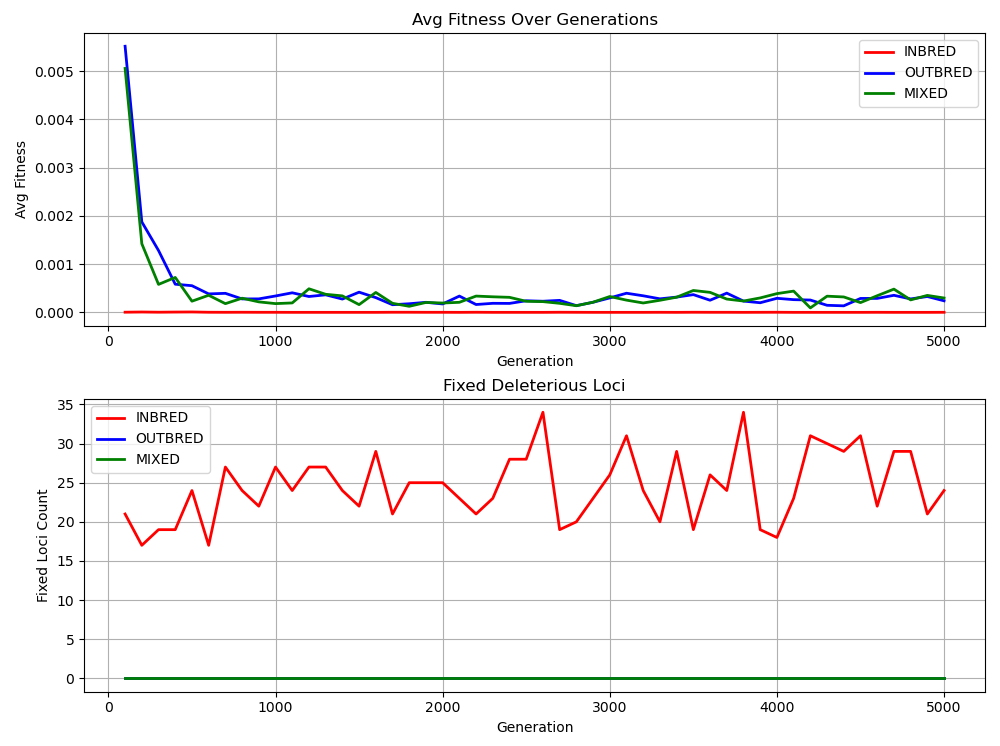

# Inbreed Simulation

A C++ simulator that shows the genetic effects of inbreeding. Cousin marriage is extremely common in India, and most people have no idea what it does to their family's gene pool over generations. I built this to show exactly that — with code, data, and graphs, not just words.<br><br>
Three groups run in parallel threads, each with a different mating strategy for performance
<br>


---
## Biology Behind It
Every person carries two copies of each gene — one from mom, one from dad. There are two kinds of alleles in this simulation: `A` (healthy, dominant) and `a` (damaged, recessive).
 
A single healthy copy is enough. If you have `Aa`, the `A` masks the damage and you're fine. The problem is `aa` — both copies damaged, nothing to mask it. That's when the disease or defect actually shows up.
 
When cousins reproduce, they share a large chunk of their DNA by descent. So the chance of a child inheriting the same damaged `a` from both sides goes up significantly. Do this for multiple generations, and the damaged alleles stop being hidden — they get fixed permanently across the entire family line. Once fixed, they don't go away. Every child born after that point carries the cost.
 
Outbreeding works the opposite way. When parents come from unrelated families, the chances of both carrying the same damaged allele are low. The healthy copy from one parent cancels out the damage from the other.

---
## GROUPS

**INBRED** — parents are always drawn from a small family pool of 10, mimicking generational cousin marriage <br><br>
**OUTBRED** — parents come from separate unrelated gene pools <br><br>
**MIXED** — alternates between inbred and outbred phases <br>
<br>
Each individual has **100 diploid loci**. Harmful recessive alleles accumulate over generations. The simulation tracks two things: <br><br>
**Average fitness** — how healthy the population is on average<br><br>
**Fixed loci** — loci where the entire population has become aa permanently, meaning the working gene is gone forever from the gene pool

## Features

* **Diploid Genome Modeling:** Individuals carry two alleles per locus.
* **Mendelian Inheritance:** Offspring inherit one random allele from each parent per locus.
* **Stochastic Mutation:** Configurable mutation rates for transitioning dominant alleles (`A`) to recessive (`a`).
* **Fitness Function:** Calculates survival probability based on the count of homozygous recessive (`aa`) loci using $P(\text{survival}) = (1 - \delta)^n$.

## Logic Overview

The simulation utilizes a standard Wright-Fisher approach (under development):

1. **Mutation:** Alleles flip based on `mutation_rate`.
2. **Recombination:** `Individual::reproduce` simulates independent assortment.
3. **Selection:** `fitness(delta)` calculates the biological cost of deleterious mutations.
---
## Config
 
All parameters in the `simconfig` namespace at the top of `main.cpp`:
 
| Parameter | Default | What it does |
|---|---|---|
| `POP_SIZE` | 500 | individuals per population |
| `LOCI_COUNT` | 100 | diploid loci per individual |
| `GENERATION` | 5000 | generations to simulate |
| `DELTA` | 0.3 | fitness penalty per `aa` locus |
| `INBRED_POOL` | 10 | family pool size for inbred mating |
 
---

## Run

```bash
make && python plot.py
```
Output is written to `results.csv`<br><br>
**Windows User:** <br>Please modify the output file into `.exe` in `Makefile`.<br>
**Important Note:** The Compiler flags are set compiler that is Native to the Cpu that compiles the program, So **The Binary is not a Portable File**

---